## [Configuration]{.mark}

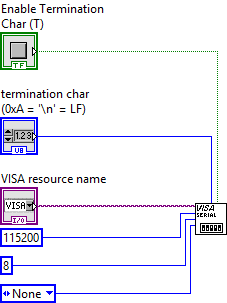{width="1.3254188538932634in"
height="1.7691721347331584in"}

*Communication configuration blocks*

[For the configuration part, we use the VISA configure Serial Port
block, having downloaded the necessary drivers beforehand.]{.mark}

[Then we create the control blocks and/or constants necessary for its
proper functioning: in our case we will specify]{.mark}

-   [The Visa Resource Name (to choose the appropriate COM port)]{.mark}

-   [The activation of a termination character to separate the different
    > messages during reception]{.mark}

-   [The baud rate which will be identical to the one used by the
    > microcontroller.]{.mark}

-   [The existence or not of a parity bit]{.mark}

-   [As well as the size of the UART payload]{.mark}

## [Writing from LabVIEW]{.mark}

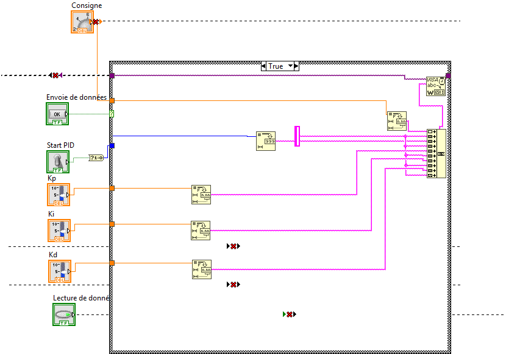{width="4.7245658355205595in"
height="3.3127471566054245in"}

*LabVIEW to STM32 write blocks*

[In our case, we have several variables to transmit from LabVIEW to the
microcontroller used:]{.mark}

-   [A boolean variable indicating the start or stop of the
    > system]{.mark}

-   [Real numbers containing the constants Kp, Ki and Kd of our
    > implemented PID.]{.mark}

-   [A float containing the instruction for tests.]{.mark}

[Therefore, it is necessary to separate the variables with \" \\n \" to
break up the message when receiving.]{.mark}

[So our frame of data to be sent is a character string containing the
variables to be sent separated by a predefined character \" \\n \" where
from the necessity to convert the variables into character strings and
to carry out a concatenation before sending it.]{.mark}

[It is necessary to implement on microcontroller an algorithm of
decomposition of the sent frame to be able to extract the data.]{.mark}

## [Reading from LabVIEW]{.mark}

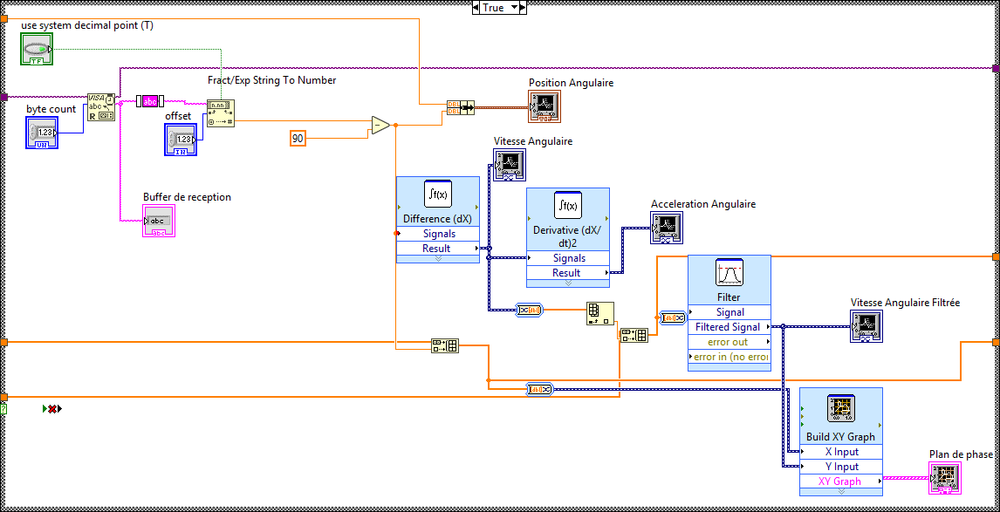{width="6.267716535433071in"
height="3.2083333333333335in"}

*Blocks for reading data received from STM32*

[LabVIEW is used in our case to receive the measured angular position on
microcontroller.]{.mark}

[To solve communication problems, we have deliberately sent the measured
angle with an offset of + 90 degrees to ensure that the number is always
positive.]{.mark}

[This angle is processed in LabVIEW to be corrected and displayed on a
graph.]{.mark}

[From the received angles we drift twice to obtain respectively a speed
and an angular acceleration.]{.mark}

[We also perform a filtering on the calculated velocity to smooth the
obtained curve.]{.mark}

[Moreover, we use the angular position and the angular velocity to plot
the phase plane in real time by designating them respectively as X and
Y.]{.mark}

## [Final result]{.mark} 

### **Interfaces**

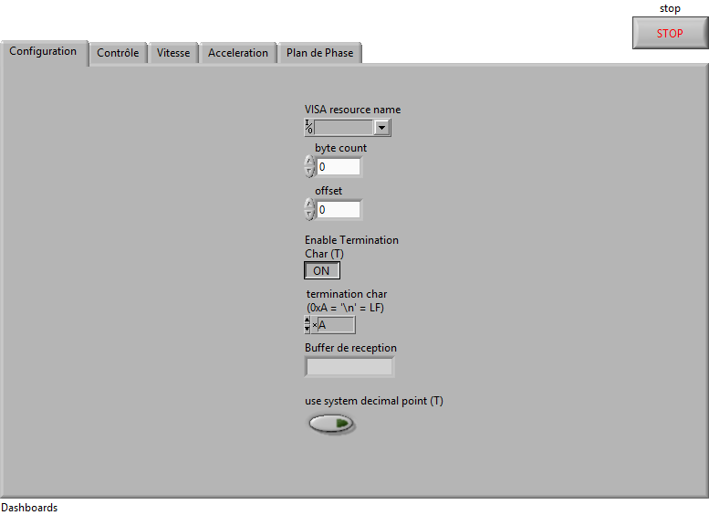{width="5.14455271216098in"
height="3.7341983814523183in"}

*Screenshot of the control panel*

²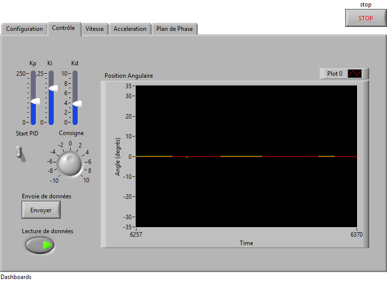{width="5.12251312335958in"
height="3.718199912510936in"}

*PID control tab and angular position curve*

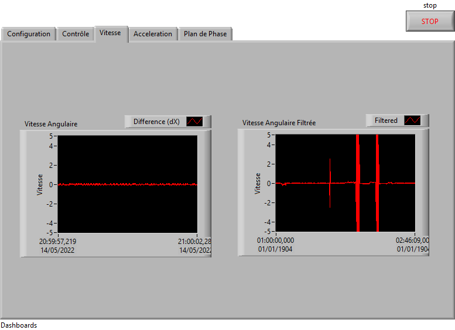{width="5.64721019247594in"
height="4.099054024496938in"}

*Filtered and unfiltered speed panel*

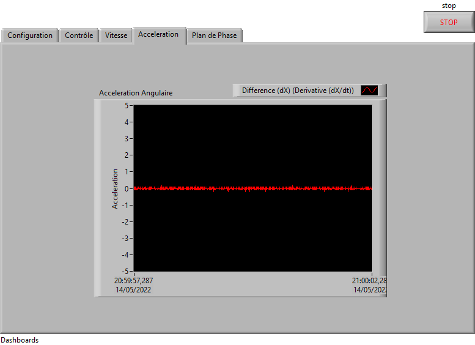{width="5.599646762904637in"
height="4.0645308398950135in"}

*Acceleration panel*

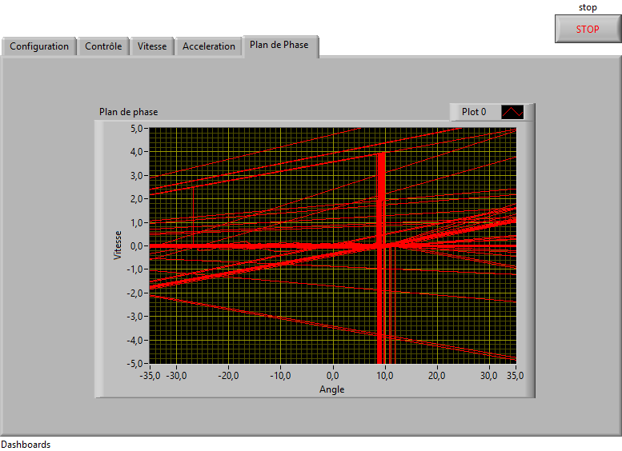{width="5.57831583552056in"
height="4.049046369203849in"}

*Phase plan tab*

### **[Real time plot]{.mark}**

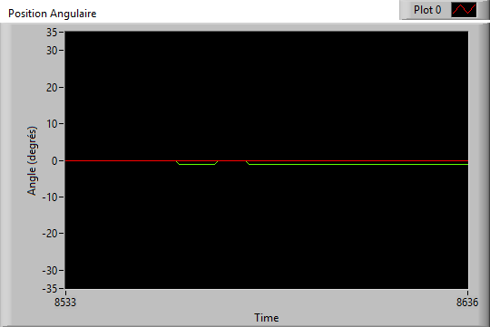{width="5.625in" height="3.7604166666666665in"}

*Angular position time plot*

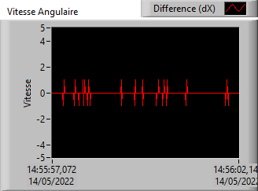{width="4.175542432195975in"
height="3.0934667541557306in"}

*Angular velocity curve*

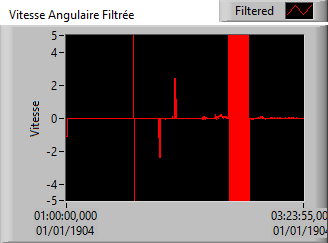{width="4.286871172353456in"
height="3.1759448818897638in"}

*Curve of the filtered angular velocity*

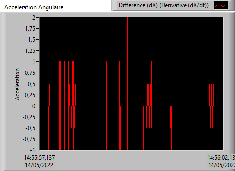{width="5.0in" height="3.6354166666666665in"}

*Angular acceleration*

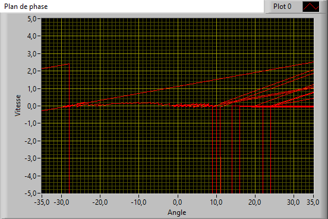{width="4.78957895888014in"
height="3.2017300962379704in"}

*Phase Diagram*
